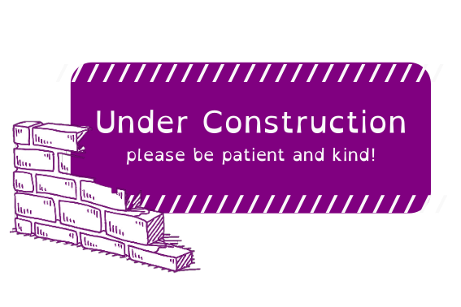

  

[When's our next meeting?](https://equitea-university-of-leicester.github.io/Equitea%20Schedule.pdf)

<h2><u>Previous Sessions:</u></h2>
[Town Hall Pitch](https://equitea-university-of-leicester.github.io/Equitea%20Schedule.pdf)
[10/10/23: Introduction and Code of Conduct](https://equitea-university-of-leicester.github.io/Equitea%20Schedule.pdf)
[14/11/23: Accessibility in communicating science](https://equitea-university-of-leicester.github.io/Equitea%20Schedule.pdf)

<h2><u>Resources:</u></h2>
<h4>Accessibility in communicating science:</h4>
[Accessibility in your slides and figures](https://equitea-university-of-leicester.github.io/Accessibility.md)
<h4>LGBTQIA+:</h4>
[Accessibility in your slides and figures](https://equitea-university-of-leicester.github.io/Accessibility.md)

<h2><u>Other Equiteas:</u></h2>
<h6>Equitea initiatives have already been established at other universities. They also have good resources on their pages, take a look!</h6>
[University of Michigan](https://sites.google.com/umich.edu/astro-dei))
&sdot[University of Warwick](https://warwick.ac.uk/fac/sci/physics/research/astro/seminars/equitea/)
&sdot;[Queen's University Belfast](https://qub-arc-equitea.github.io)
